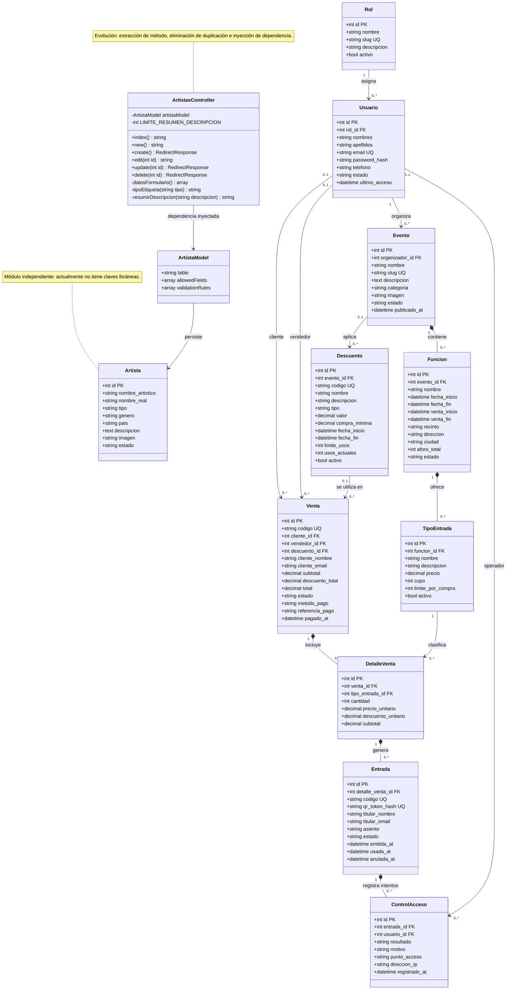

# TicketFlow - Diagrama de clases actualizado

Este diagrama representa el modelo persistente implementado en las migraciones
de CodeIgniter 4. Los campos de auditoría (`created_at`, `updated_at` y
`deleted_at`) se omiten para conservar la legibilidad.

## Restricciones compuestas

- `TipoEntrada`: (`funcion_id`, `nombre`) es único.
- `DetalleVenta`: (`venta_id`, `tipo_entrada_id`) es único.

## Relación futura no implementada

El repositorio propone relacionar `Artista` y `Evento` mediante una tabla
intermedia `evento_artista`. Esa relación no aparece en el diagrama porque
todavía no existe en las migraciones ni en los modelos.
